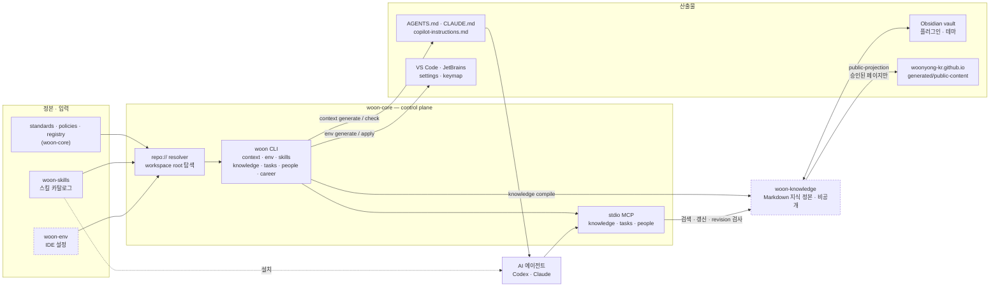

# woon-core

여러 저장소에 흩어진 AI 지침, 저장소 목록, IDE 설정, Markdown 지식 정본을 한 규칙으로 생성하고 검사하는 Python CLI입니다.

- 규칙과 저장소 메타데이터는 정본에 한 번만 두고, `AGENTS.md`, `CLAUDE.md`, IDE 설정 같은 도구별 파일은 생성물로 다룹니다. 입력과 산출물이 다르면 `check` 명령이 실패합니다.
- Wiki는 source, accepted claim, page spec을 분리해 컴파일하고 receipt를 남깁니다. 비공개 Vault는 그대로 두고 승인된 페이지만 공개 사이트에 투영합니다.
- 공개 `main`의 테스트는 1,661 passed/1 skipped입니다. 현재 Vault의 고정 질의 40개 검색 벤치는 P@5 0.97이며, 이 수치는 제품 성능이 아니라 해당 질의 세트의 lexical 검색 결과입니다.

[](https://github.com/woonyong-choi/woon-core/actions/workflows/ci.yml)


## 데모

```console
$ uv run woon doctor
status: ok
root: <workspace-root>
source: config+.woon-root
repositories: 12
missing: 0

$ uv run woon knowledge bench --wiki <vault>/wiki --no-write
documents: 2634  chunks: 8886  queries: 40
| P@1 | 0.88 |
| P@5 | 0.97 |
| 평균 소요 ms | 7.22 |
```

`root`와 `--wiki` 경로만 로컬 절대경로를 가렸고 나머지는 2026-09-28 실제 출력입니다.

## 빠르게 실행하기

Python 3.12 이상과 [`uv`](https://docs.astral.sh/uv/)가 필요하다. 아래 네 줄은 이 저장소의 checkout에서 그대로 실행된다.

```bash
uv sync --all-extras --dev     # 의존성 설치
uv run woon --version          # 0.5.6
uv run pytest -q               # 1,661 passed, 1 skipped
uv run woon doctor             # workspace root·registry·누락 저장소 확인
```

`woon doctor`부터는 workspace root가 필요하다. 처음 쓰는 기기라면 `uv tool install git+https://github.com/woonyong-choi/woon-core.git` 후 `woon init --root <경로>`와 `woon repo sync`로 registry의 저장소를 내려받는다. 나머지 명령은 [docs/cli-reference.md](docs/cli-reference.md)에 있다.

## 구조

```text
src/woon_core/
  cli.py          단일 진입점. 모든 하위 명령을 여기서 분기한다
  workspace.py    workspace root 탐색과 repo:// URI 해석
  context/        AI 지침 생성·drift 검사
  environment/    IDE 설정 생성·적용·검증
  knowledge/      지식 정본: 컴파일러 · 검색 색인 · MCP 포트
  skills/         스킬 카탈로그 검증과 배치 계획
standards/ policies/ registry/   정본 입력(표준·정책·저장소 목록)
bench/            검색 벤치 질의 세트와 실행 결과 JSON
docs/             아키텍처·CLI 레퍼런스·기능별 설계 문서
tests/            94개 파일 1,662개 테스트
```



점선 테두리는 공개하지 않는 저장소다. `woon-knowledge`는 비공개 기록을 포함하므로 저장소 자체를 공개하지 않고, 승인한 페이지만 `public-projection`으로 위키 사이트에 투영한다.

원자료가 Wiki 페이지가 되고 다시 검색·Obsidian·공개 투영 세 갈래로 나가기까지의 단계와, 컴파일러의 다섯 게이트(`schema`·`source-provenance`·`accepted-claims`·`frontmatter-h1`·`privacy`)가 각각 무엇을 거부하는지는 [docs/architecture.md](docs/architecture.md)에 정리했다. 공개 위키 사이트는 [docs.woonyong.com](https://docs.woonyong.com)이다.

## 핵심 결정과 트레이드오프

**1. 도구별 지침 파일을 전부 생성물로 취급한다.**
같은 규칙을 Codex·Claude·Copilot 세 파일에 손으로 복사하면 어느 쪽이 최신인지 알 수 없다. 정본은 `standards/`·`policies/`에만 두고 세 파일은 `woon context generate`의 산출물로 만들었다. 버린 대안은 "한 파일을 정본으로 삼고 나머지를 symlink"였는데, 도구마다 요구하는 형식과 토큰 예산이 달라 같은 바이트를 공유할 수 없었다. 대가는 지침을 손으로 고치면 다음 generate에서 사라진다는 점이고, 그래서 `woon context check --all`이 drift를 exit 1로 만든다(`src/woon_core/context/`, `tests/test_context.py` 15건).

**2. 저장소 간 참조를 `repo://` URI로 고정한다.**
절대경로를 커밋하면 기기가 바뀔 때마다 깨진다. workspace root를 탐색한 뒤 registry의 저장소 ID로 해석하는 resolver를 뒀고, 충돌하는 root가 둘 이상이면 추측하지 않고 실패한다. 버린 대안은 환경변수 기반 경로였다 — 설정이 사람의 shell에 남아 재현되지 않는다. 대가는 resolver를 거치지 않는 외부 도구가 경로를 직접 못 읽는다는 점이다(`src/woon_core/workspace.py`, `registry/repositories.yaml`의 저장소 12개).

**3. 지식 갱신을 MCP port 뒤에 두고 쓰기 전 revision을 검사한다.**
에이전트가 vault 파일시스템을 직접 쓰면 두 에이전트가 같은 문서를 고칠 때 한쪽이 조용히 덮인다. document·search·history 세 port를 두고, 쓰기는 호출자가 읽은 revision과 현재 revision이 같을 때만 통과시킨다. 버린 대안은 파일 잠금인데, stdio MCP는 클라이언트가 붙어 있는 동안만 살아 있어 잠금 해제 시점을 보장할 수 없다. 대가는 호출자가 현재 revision을 먼저 읽어야 한다는 점이다(`src/woon_core/knowledge/`, `tests/test_knowledge.py` 42건 · `tests/test_mcp_server.py` 3건).

**4. 컴파일은 결정적이고, 게이트가 통과 조건을 만든다.**
LLM이 쓴 문장을 그대로 위키에 넣으면 어느 문장이 어디서 왔는지 되짚을 수 없다. source·accepted claim·page spec에서 페이지를 생성하고 receipt를 남기며, 존재하지 않는 source나 승인되지 않은 claim을 참조하면 컴파일이 실패한다. 정렬·타임스탬프·경로 정규화를 모두 고정해 같은 입력이면 같은 바이트가 나온다 — cold rebuild를 두 번 돌려도 vault working tree가 그대로임을 확인했다. 대가는 페이지 한 장을 고치는 데 세 카탈로그를 함께 고쳐야 한다는 점이고, 이 구조가 환각을 막아 주지는 않는다(`tests/test_compiled_wiki.py` 172건).

**5. 검색 품질을 고정 질의와 기대 문서로 비교한다.**
제목이 아니라 실제로 다시 찾을 때 쓰는 문장을 질의로 두고, 각 질의가 기대 문서를 top-5 안에 넣는지 측정합니다. 현재 40개 중 39개가 top-5에 들어오고 1개는 lexical 색인이 찾지 못합니다. 이 결과는 현재 Vault와 질의 세트에만 해당하며 의미 기반 검색 품질을 보장하지 않습니다(`bench/knowledge-queries.yaml`).

## 검증

| 스위트 | 검증 대상 | 개수 | 실행 |
| --- | --- | --- | --- |
| 전체 | 단위·계약·회귀 | 1,662 (1,661 통과 · 1 skip) | `uv run pytest -q` |
| `tests/test_compiled_wiki.py` | 컴파일 결정성과 다섯 게이트 | 172 | `uv run pytest -q tests/test_compiled_wiki.py` |
| `tests/test_vault_health.py` | vault frontmatter·링크 건강성 | 73 | `uv run pytest -q tests/test_vault_health.py` |
| `tests/test_public_projection.py` | 승인된 페이지만 공개로 나가는지 | 70 | `uv run pytest -q tests/test_public_projection.py` |
| `tests/test_knowledge.py` + `test_mcp_server.py` | 검색·청킹·이웃 발췌·revision 검사 | 45 | `uv run pytest -q tests/test_knowledge.py tests/test_mcp_server.py` |
| `tests/test_search_bench.py` | 벤치 지표와 실제 vault 페이지 발췌 | 7 | `uv run pytest -q tests/test_search_bench.py` |
| `tests/test_context.py` | 생성된 AI 지침의 drift 검사 | 15 | `uv run pytest -q tests/test_context.py` |

CI는 macOS·Linux에서 `ruff check` · `ruff format --check` · `mypy src` · `pytest`를 돌리고, Windows에서는 패키지 설치와 timezone 데이터까지 확인한다([`.github/workflows/ci.yml`](.github/workflows/ci.yml)).

실측 수치:

| 항목 | 값 | 재현 |
| --- | --- | --- |
| 구현 / 테스트 코드 | 132파일 78,185줄 / 94파일 50,021줄 (2026-09-28) | `git ls-files 'src/**/*.py' \| xargs wc -l` |
| 검색 벤치 | 질의 40건 · P@1 0.88 · P@5 0.97 · 평균 7.22 ms (2026-09-28) | `woon knowledge bench --wiki <vault>/wiki --no-write` |
| 읽는 문맥 | 문서 전체 3,635자 → 절 407자 → 절±1 1,010자 (2026-09-28) | 위와 같음 |

`pdftoppm`(poppler)이 없으면 스캔 crop 테스트가 실패하고, Docling extra가 없으면 문서 intake 테스트 1건이 skip된다.

## 범위와 한계

- 단일 사용자·단일 기기를 전제로 설계했다. 동시 편집은 optimistic revision 검사까지만 막고, 그 이상의 병합 전략은 없다.
- 실제 운영 대상은 macOS다. Linux는 동일 POSIX 환경으로 회귀 테스트에 쓰고, Windows는 패키지 설치·정적 검사·timezone 데이터까지만 지원한다. POSIX 권한 동작은 Windows 지원 대상이 아니다.
- 컴파일 게이트는 출처가 없는 문장을 막을 뿐 내용의 사실 여부를 검증하지 않는다. 환각은 차단되지 않는다.
- 검색은 SQLite FTS 기반 lexical 색인이다. 현재 벤치 질의 40건 중 1건은 어휘가 겹치지 않아 top-5 안에 들어오지 못한다.
- 공개 투영이 페이지 단위 승인이라 대량 공개가 느리다. 공개 위키 240쪽 중 45쪽은 아직 키워드만 등록된 상태다.

## 관련 링크

- [docs/architecture.md](docs/architecture.md) — 파이프라인 단계와 컴파일러 게이트
- [docs/cli-reference.md](docs/cli-reference.md) — 전체 명령·파이프라인·정본 지식 MCP 등록
- [docs/repository-standard.md](docs/repository-standard.md) — 저장소 표준(변경 전 확인)
- [registry/repositories.yaml](registry/repositories.yaml) — 저장소 ID·경로·역할 정본. GitHub profile·Pages 출력 저장소는 여기 등록된 이름과 호환 계약을 유지한다
- [docs.woonyong.com](https://docs.woonyong.com) — 승인된 페이지가 투영되는 공개 위키
- [woon-skills](https://github.com/woonyong-choi/woon-skills) — 스킬 카탈로그 저장소

변경 전 [저장소 표준](docs/repository-standard.md)과 [최소 검증 원칙](standards/code.yaml)을 확인한다. 생성 지침 비교는 `woon context check core --artifacts-only`, 전체 경로 감사가 필요한 변경은 `woon context check core`로 확인한다.
