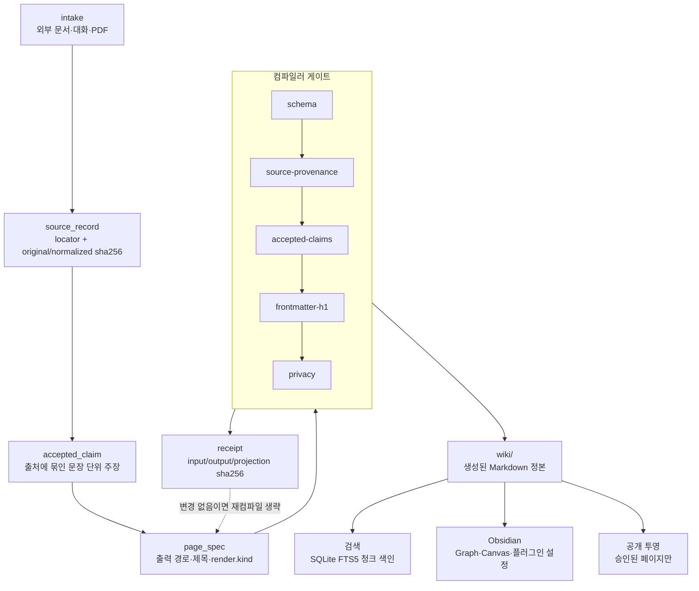

# 지식 컴파일 아키텍처

원자료 한 건이 Wiki 페이지가 되고 다시 세 갈래로 투영되기까지, 각 단계가 무엇을
보장하고 무엇을 거부하는지 정리한다. 명령 사용법은 [README](../README.md),
저장소 경계는 [repository-standard.md](repository-standard.md)를 따른다.

## 전체 흐름

## 단계별 책임

| 단계 | 산출물 | 보장하는 것 |
| --- | --- | --- |
| intake | 원자료 사본 + 등록 요청 | 원본 바이트를 Vault 안에 고정하고 출처를 기록한다 |
| source_record | `catalog/llm-wiki/sources.yaml` | `locator`와 원본·정규화 sha256으로 같은 원자료를 다시 식별한다 |
| accepted_claim | `catalog/llm-wiki/claims.yaml` | 페이지에 쓸 수 있는 문장을 `accepted` 상태의 주장으로만 한정한다 |
| page_spec | `catalog/llm-wiki/pages.yaml` | 출력 경로·제목·렌더링 방식을 선언하고 본문을 직접 쓰지 못하게 한다 |
| 컴파일러 게이트 | (통과 또는 거부) | 아래 표의 다섯 검사를 모두 통과한 페이지만 파일로 쓴다 |
| receipt | `catalog/llm-wiki/receipts.yaml` | 입력·출력·투영 hash를 묶어 재컴파일 필요 여부를 판정한다 |
| wiki/ | 생성된 Markdown | 한 개념당 정본 한 파일을 유지한다 |

## 각 게이트가 거부하는 것

컴파일은 다섯 검사를 순서대로 적용하고, 하나라도 실패하면 그 페이지를 쓰지 않는다.
검사 이름은 receipt의 `checks`에 그대로 기록된다.

| 게이트 | 거부하는 입력 |
| --- | --- |
| `schema` | 출력 경로가 Vault 밖이거나 `.md`가 아닌 경우, `render.kind`가 `source-body`·`claims`·`toc-only`가 아닌 경우, source·claim 레코드에 필수 필드나 sha256이 빠진 경우 |
| `source-provenance` | page_spec이 존재하지 않는 `source_id`를 참조하는 경우, `source-body`로 렌더링하면서 그 source를 `source_ids`에 넣지 않은 경우 |
| `accepted-claims` | `accepted`가 아닌 주장을 페이지가 인용하는 경우, 보충 주장을 `source-body` 이외의 렌더링에서 쓰는 경우, 같은 주장을 중복 지정한 경우 |
| `frontmatter-h1` | frontmatter `title`과 페이지 제목이 다른 경우, 생성된 본문의 H1이 그 제목과 어긋나는 경우 |
| `privacy` | source의 `privacy`가 `local-only`·`private`·`public` 중 하나가 아닌 경우, 후속 source가 원본의 공개 범위를 넓히는 경우 |

## receipt가 결정하는 재컴파일

receipt는 페이지마다 `input_sha256`(page_spec + source + claim + curation),
`compiler_projection_sha256`(컴파일러가 소유한 본문), `output_sha256`(실제 파일)을
함께 보관한다. 세 값과 디스크의 파일이 모두 일치하면 그 페이지는 건너뛰고
`unchanged`로 센다. 하나라도 어긋나면 다시 렌더링한다. `woon knowledge compile`은
전체 소요 ms와 대상 페이지 수를 함께 보고하므로, 컴파일 비용이 페이지 수에 따라
어떻게 움직이는지 실행마다 확인할 수 있다.

사람이 손으로 고친 영역은 `preserve_managed_context`가 보존한다. 컴파일러가 소유한
구간만 다시 쓰고, 소유하지 않은 구간이 바뀌었으면 실패로 처리한다.

## 세 갈래 투영

`wiki/`는 세 소비자가 각자 읽어 가며, 어느 쪽도 정본을 되돌려 쓰지 않는다.

- **검색**: `woon knowledge index`가 Markdown을 제목 단위 절로 나눠 SQLite FTS5에
  넣는다. 각 청크는 문서 내 순서인 `position`을 갖고, `read_excerpt`는 절 하나만
  돌려주거나 `before`/`after`로 앞뒤 절을 함께 돌려준다. 전체 문서를 읽지 않고도
  답에 필요한 만큼만 읽게 하는 것이 목적이며, 실제 비용은
  [`bench/knowledge-queries.yaml`](../bench/knowledge-queries.yaml)과
  `woon knowledge bench`로 측정한다.
- **Obsidian**: `woon knowledge configure-navigation`이 Graph 색상과 플러그인 설정을
  생성한다. Vault 설정은 receipt와 backup을 남기고 바꾼다.
- **공개 투영**: `woon knowledge public-projection`이 공개 승인된 페이지만 골라
  별도 저장소로 내보낸다. 본문이 없는 키워드 stub은 투영 단계에서 제외한다.
